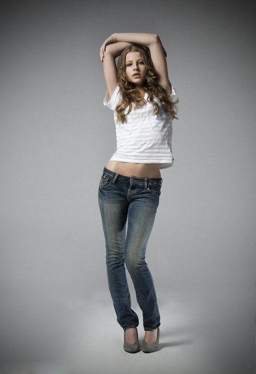
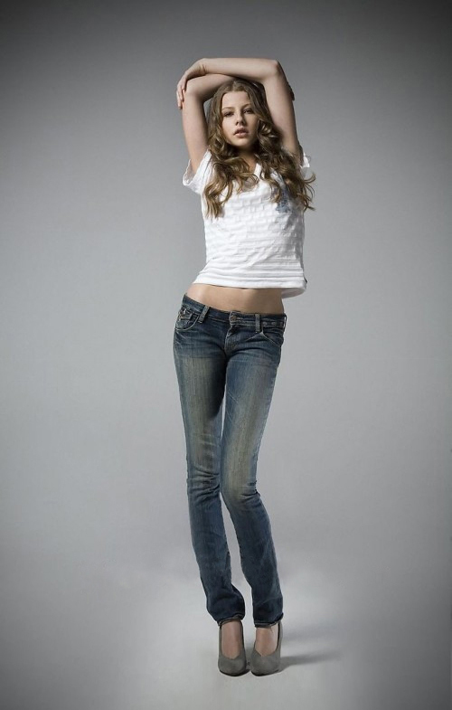
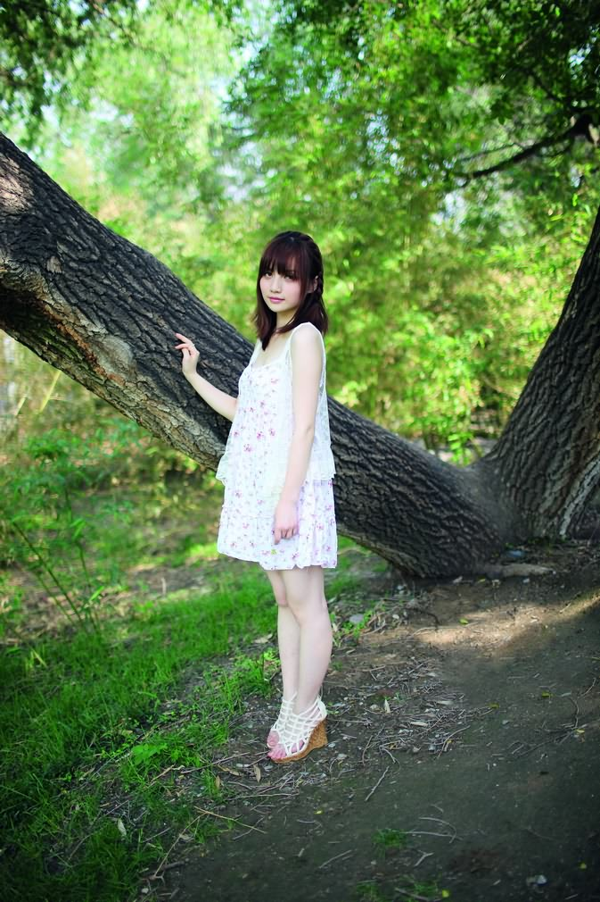
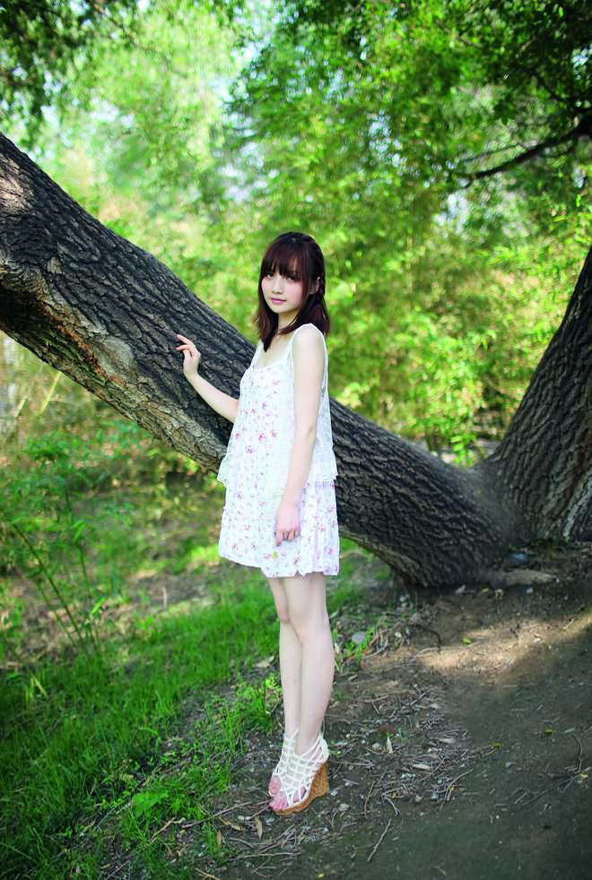
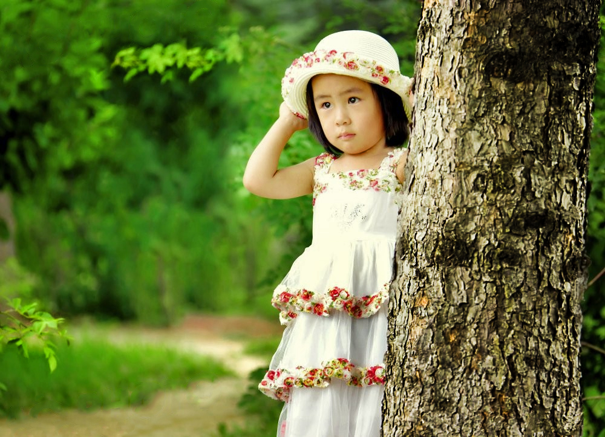
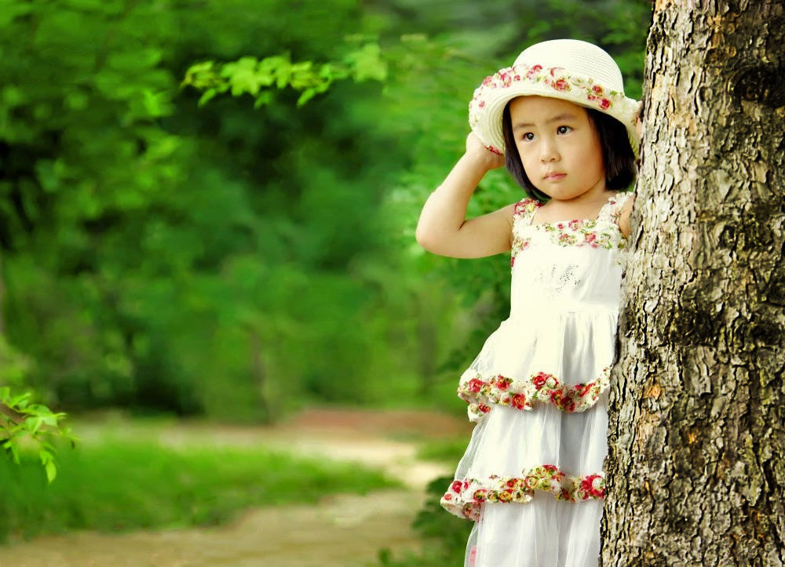

## 第一堂：剪裁工具Crop-Tool
### 视频

## **剪裁工具(Crop Tool)**
使用Crop Tool可以剪裁图片，旋转图片，和重新构图。
1. 场景1）若图片中不想要的元素在画面的某一侧，而将这一侧剪裁掉以后能够使得图片更加美观，可以使用Crop Tool选择要保留的图片元素而将杂质元素剪裁掉。
2. 场景2）若图片中的元素在拍摄时未到达横平竖直，没有对准水平线导致画面失衡而影响美观，可以使用Crop Tool旋转图片，到达平衡画面的效果，同时注意剪裁边和角不要超出原来图片边缘。
3. 场景3）若图片中的主体元素未在画面的三分线中而影响到画面美观，可以使用Crop Tool拉伸图片以到达重新构图的效果。
### 效果图

##剪裁+自由变换(Free Transform)
自由变换可以拉伸女生的大长腿。
### 效果图

##内容识别比例(Content-Aware Scale)
内容识别比例可以只能拉伸陪衬元素的部分，而主题部分，比如人像会保持比例不变。在拉伸带人像的照片时，确保使用内容识别比例选项中的保护肤色区，这样可以使得人像部分的比例保持不变。
###效果图

