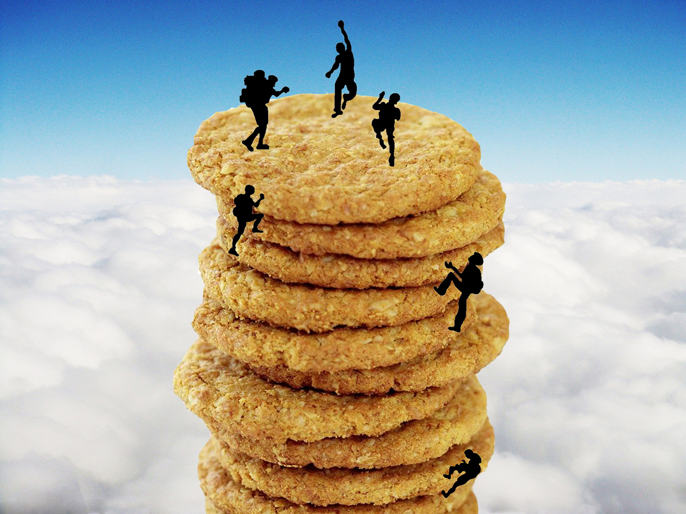
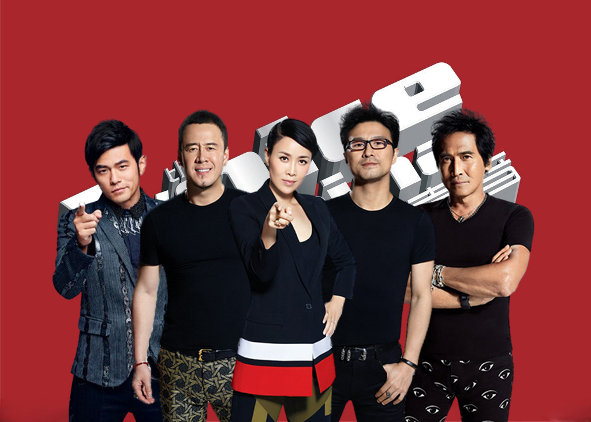
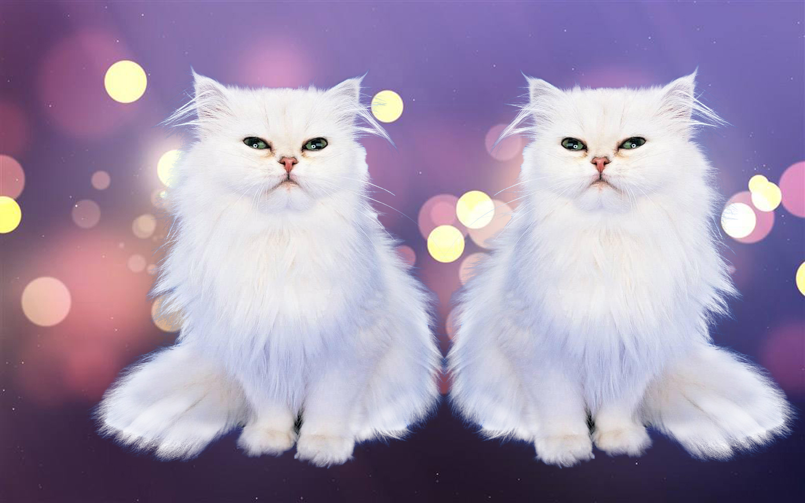

## 第二堂：抠图

## 视频

## 抠图工具  
1. 磁性套索，该工具用于抠出不规则但是颜色相近的元素。
2. 魔术棒工具，该工具用于抠出颜色相同的区块。
3. 快速选择工具， 该工具用于抠出人像。 
### 效果展示
使用磁性套索抠出点心，使用魔术棒工具选择小人，主要选择单个小人时需要勾选魔术棒工具栏中的**连续**。 

使用快速选择工具抠出每一个人物，此时注意修改魔术棒半径以选取耳朵部分。在头发散乱时，尤其是几位男性老师，需要在调整边缘中，用Refine Edge Brush Tool来选取边缘的头发丝。另外，设置智能半径为2px使得人物轮廓更清晰。在新图层中，使用图层 > 修边 > 去边 设置1px。然后，使用加深工具涂抹外围头发。  

对于浅色毛发，例如白色小猫，在新图层中则需用减淡工具涂抹外围头发。 

