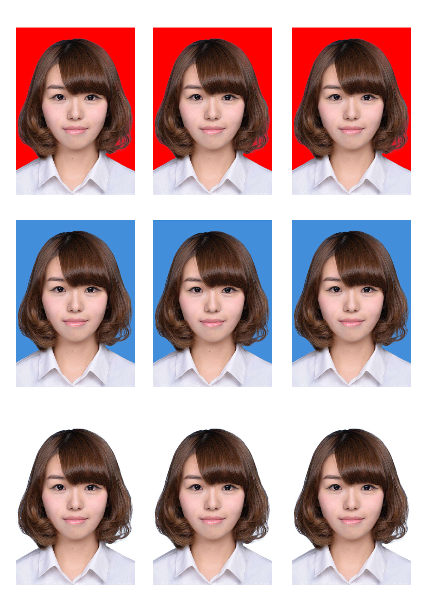
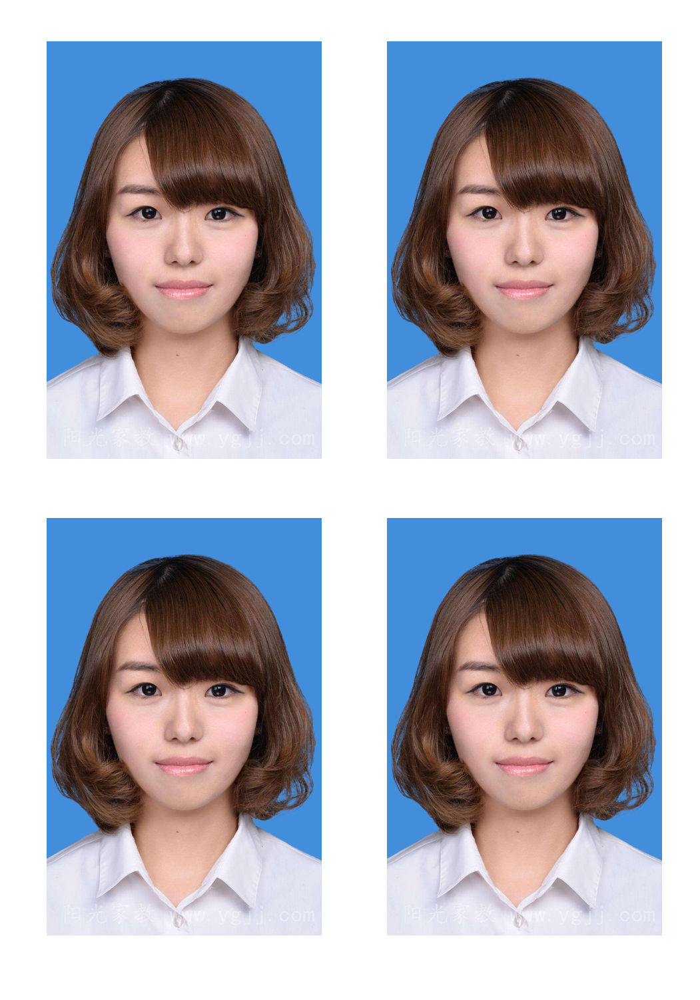

## 第三堂：制作证件照

## Youku视频

http://player.youku.com/embed/XMzU5MDcyODU3Mg==  
证件照大小有1寸和2寸，一张5寸相纸可以放9张1寸照片或4张2寸照片。证件照的背景通常有红色，蓝色，和白色。以下是证件照的参考值： 

+ 1寸 2.5cm*3.5cm 300象素/英寸 
+ 2寸 3.5cm*5.3cm 300象素/英寸 
+ 5寸 8.9cm*12.7cm 300象素/英寸 

其中, 5寸纸张可以打印3x3的9张1寸照片, 可以打印2x2的4张2寸照片。 

背景色参考: 

+ 蓝色 - R: 67 G: 142 B: 219
+ 红色 - R: 255 G: 0 B: 0 
+ 纯白色 - R: 255 G: 255 B: 255 (二代身份证和社保)

制作证件照要抠图，同样使用快速选择工具，将半径调整为50左右，然后设置调整边缘，将智能半径设为2px，使用Refine Edge Brush Tool来涂抹头发。

### 效果图  
1寸照片  

  
2寸照片  

  

